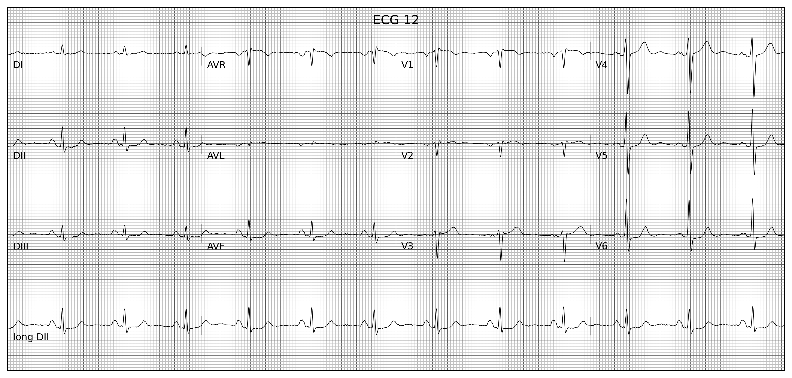
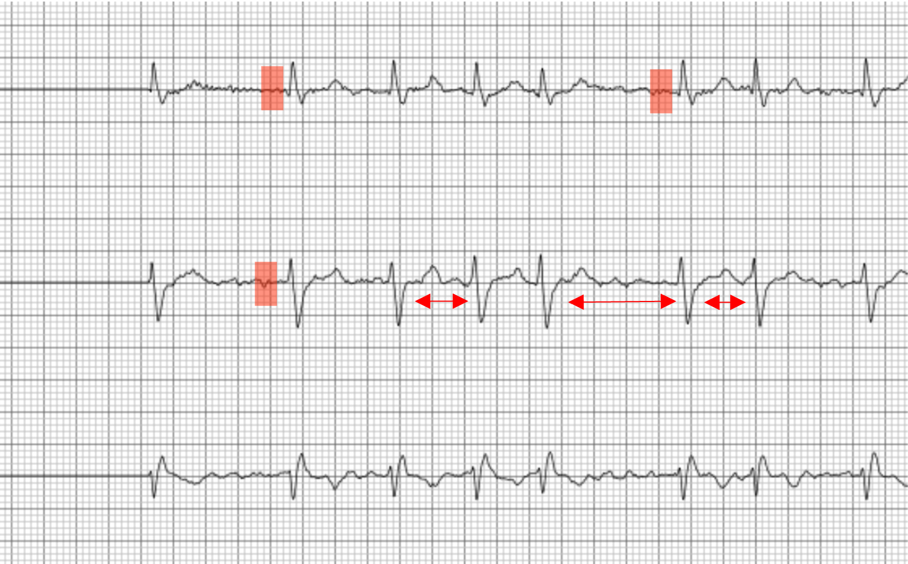
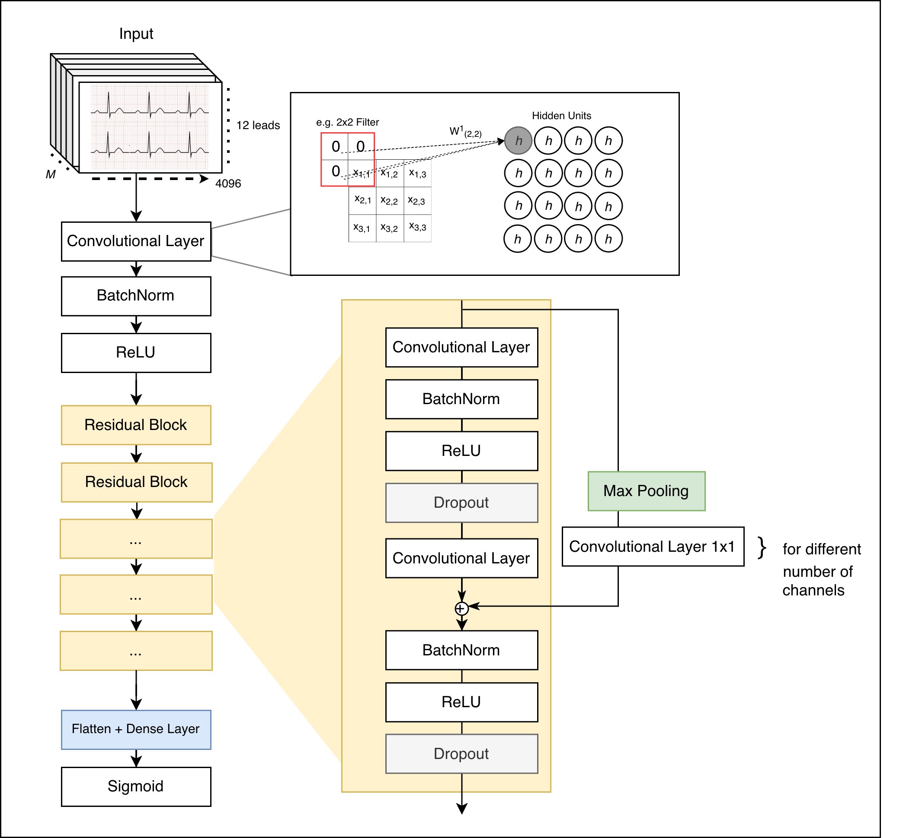
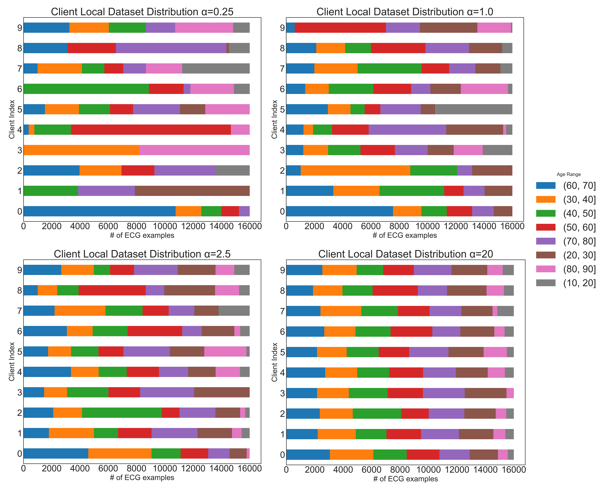
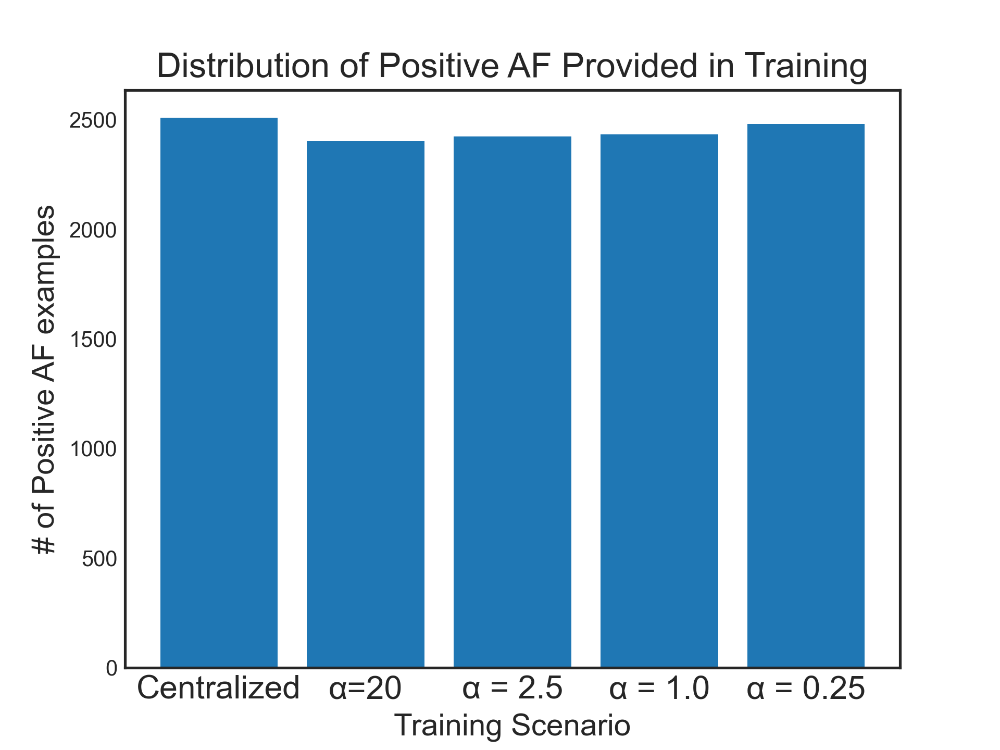

# Federated Learning for automated ECG classification in heterogeneous data splits

Purpose
-------
This repository contains code, experiments and thesis material for studying federated learning (FL) under non-iid client data distributions for the task of atrial fibrillation (AF) detection on single-lead ECGs (CODE15 dataset). The codebase implements centralized and federated training, synthetic non-iid partitioning, and a set of baselines (FedAvg, FedProx, SCAFFOLD, FedNova) together with evaluation artifacts used in the accompanying thesis.

Target reader
-------------
An experienced ML engineer or researcher interested in federated learning for medical time-series classification. Familiarity with PyTorch, Flower (flwr) or Ray (for distributed experiments), and standard experimental reproducibility practices is assumed.

Quick highlights
---------------
- Task: binary AF detection on CODE15 ECG dataset (single-lead)
- Models: ResNet-style 1D classifier (resnet.py)
- FL strategies implemented: FedAvg, FedProx, SCAFFOLD
- Partitioning: Dirichlet and age-based / label-skew splits to simulate clinical heterogeneity.
- Experiments: scripts and notebooks for centralized training, local federated simulations using Flower Federated Learning framework, and codetest evaluations

Representative figures (from thesis/images)
-------------------------------------------
ECG waveform examples and modeling pipeline:

- ECG examples: 
  

> Observe that there is a dampened initial P wave, and an irregularly irregular heart rhythm, as some of the notable signs of AFib.

  

> Before sending to training: Data was anonymized, de-duplicated and pre-processed to remove noise in ECG signals, and e.g. de-trend. Additionally, the age and gender-related information did not get involved in the learning.

- ResNet architecture (1D ResNet used in experiments):
  

Client partitioning and class balance illustrations (used to create non-iid scenarios - by **patient age**):

- Dirichlet splits used to create heterogeneous client label distributions:
  

> The model does not know or learn on the patient ages, and only can read the ECG signals themselves.

- AF prevalence / distribution across dataset:
  

> Important to not give a highly unbalanced number of binary targets, and strictly observe the feature's heterogeneity effect on classification performance, keeping total positive learned examples similar.

Important directories and files
------------------------------
- test-code-holdout/: Useful diagrams and plots, and ways to construct them. Requires the raw data logs and files from the federated simulations.
- images/: Useful screenshots of ECG exam examples, data preparation process and splitting for the varying heterogeneity experiments by patient age.
- niid_bench/: main experimental framework used as inspiration for writing federated training and partitioning logic. Key files:
- federated/pytorchexample/: a Flower+Ray example and config files; contains pytorchexample/ containing ALL logic for the federated simulations
- centralized.py, resnet.py: single-machine centralized training and model definition
- codetest.ipynb, codetest_results/: evaluation on clinical CODE test splits and expert comparisons
- requirements-final.txt and pyproject.toml: dependency lists for reproducing experiments and defining configurations.

How to reproduce experiments (recommended quick path)
----------------------------------------------------
1. Create and activate virtual environment (Python 3.9+ recommended):

   python -m venv venv
   source venv/bin/activate
   pip install -r requirements-final.txt

2. Prepare dataset: the CODE15 dataset is not included. Inspect load_datasets() to confirm paths.

3. Run a federated simulation locally (Flower simulation engine):
   cd federated
   flwr run .

4. Centralized baseline: please have a look at the shell script `start.sh`.

5. Inspect results. Plots produced during experiments are saved under results/ for run-specific outputs.

Notes and implementation details
--------------------------------
- Models: the ResNet model in resnet.py is a compact 1D convolutional ResNet.
- Partitioning: dirichlet-splits.png and code15-distr-by-age.png illustrate the non-iid setups used (label-skew, age-skew). Dirichlet alpha controls heterogeneity across clients.
- Algorithms: implementations in `federated/pytorchexample/` follow standard FL loops: local training steps (client_*.py) and server aggregation (strategy implementations). FedProx adds proximal term on clients; SCAFFOLD uses control variates.
- Evaluation: codetest.ipynb and codetest_results contain ROC/PR curves with comparisons to clinician labels and gold-standard annotations.

Reproducibility tips
--------------------
- Keep the same partitioning seeds to reproduce the same non-iid splits. 
- Use the provided pyproject.toml and requirements-final.txt to pin dependencies.

Where to start for new experiments
---------------------------------
- For quick debugging: run centralized.py on a small subset of the dataset to make sure data loading & model code works.
- To reproduce a federated run locally: flwr simulation (federated/ directory) is the fastest path; for multi-node Ray experiments follow README instructions in federated/ and ensure Ray cluster is configured. The `$HOME/.flwr/config.toml` file needs to be modified.
- To implement new aggregation or client behavior: extend niid_bench/client_*.py and update the server strategy under niid_bench/ (server_*.py) and run run_exp.py.

License and citation
--------------------
See LICENSE in the repository root. If using parts of this work in research, please cite the accompanying thesis.

--
Generated README summary for experienced ML engineers. Images referenced above are stored under thesis/images/ and were chosen for their relevance: ecg examples, model architecture, partitioning visualizations, and overall dataset statistics.